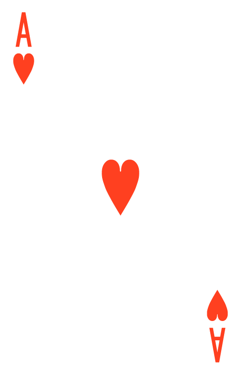
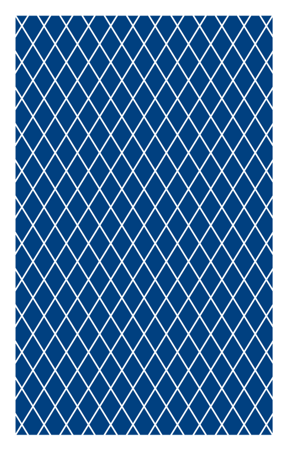
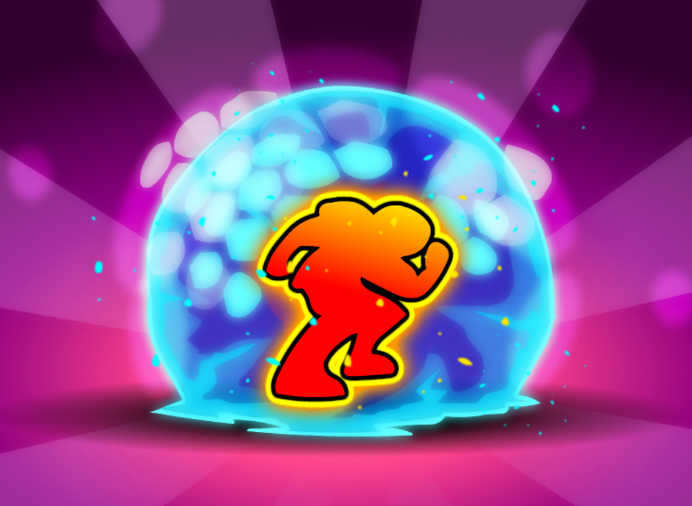
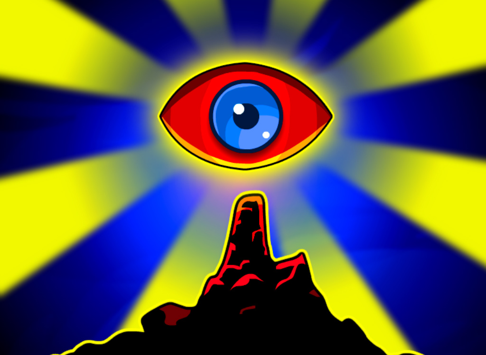
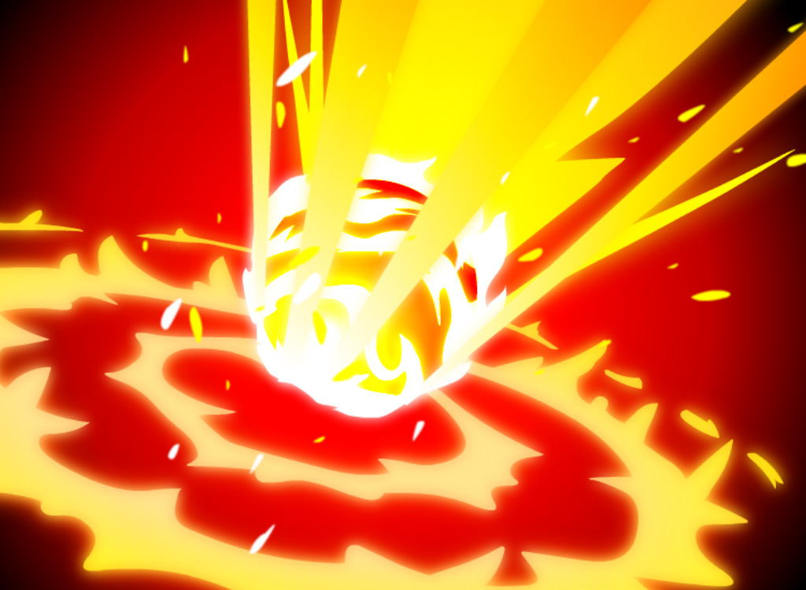
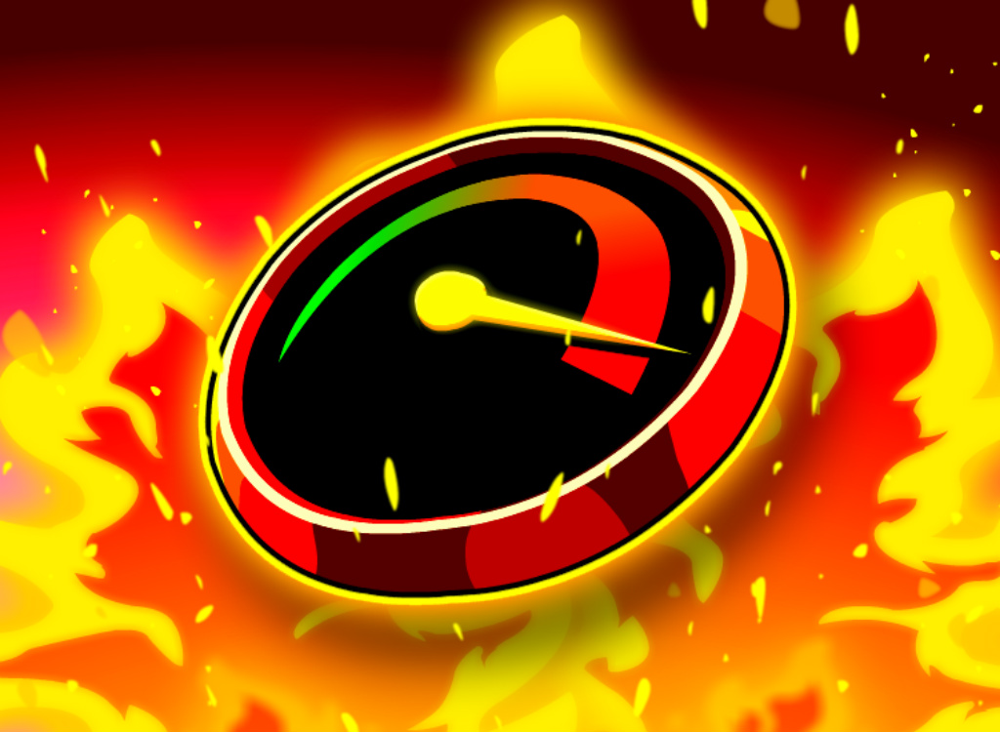

# 🎴 21 Multiplayer Local

Jogo de **21 multiplayer local para até 5 jogadores**, feito com **HTML, CSS e JavaScript puro**.

O objetivo é chegar o mais perto possível de **21 sem passar**, usando cartas e poderes especiais.

---

# 🎴 Preview

## 🃏 Cartas do baralho

## ✨ Poderes

### Last Stand

Se passar de 21, descarta automaticamente a última carta comprada.

### Freeze

Força um jogador alvo a parar no próximo turno.

### Future Sight

Mostra o valor das próximas 3 cartas do baralho.

### Burn Card

Remove uma carta da própria mão.

### Overclock

Se estiver entre 18 e 20, ganha +1 ponto.

# 🚀 Funcionalidades

* 2 a 5 jogadores
* menu inicial para escolher jogadores
* sistema de rodadas
* contador de vitórias
* poderes aleatórios
* destaque do jogador da vez

---

# 🛠️ Tecnologias

* HTML
* CSS
* JavaScript

---

# ▶️ Como executar

Abra o arquivo `index.html` no navegador.

---

# 👨‍💻 Autor

Gabriel Jardim de Souza
