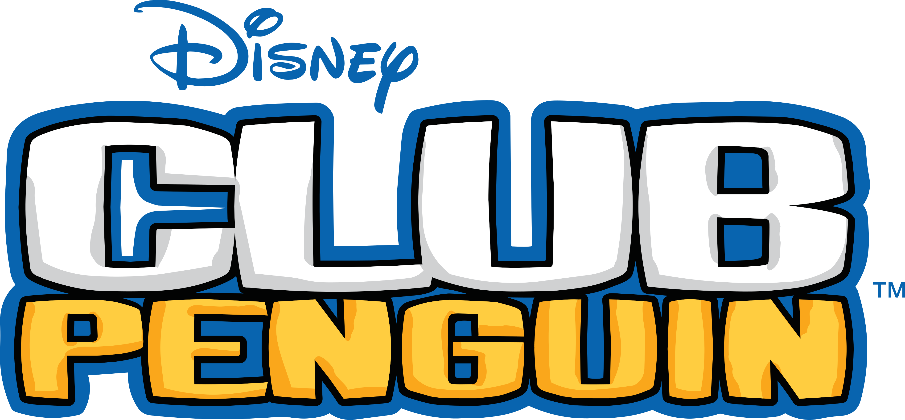
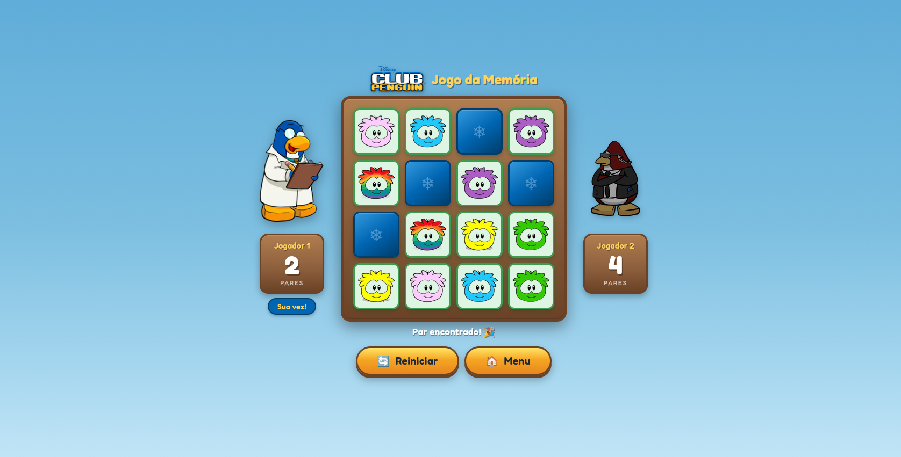
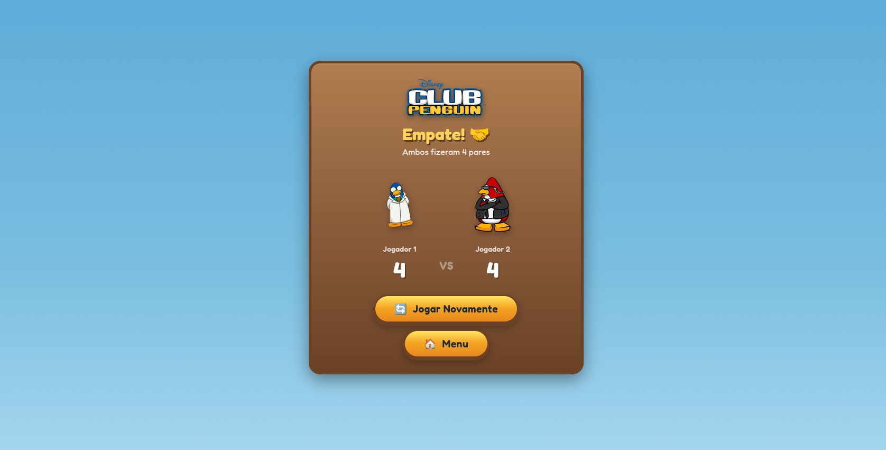

# 🐧 Club Penguin — Jogo da Memória

Jogo da Memória para dois jogadores com temática inspirada no **Club Penguin**, desenvolvido com HTML, CSS e JavaScript puros.



---

## 🎮 Como Jogar

1. Na **tela inicial**, clique em **❄️ JOGAR!** para começar a partida.
2. O jogo é para **2 jogadores** que se alternam no mesmo computador.
3. Na sua vez, clique em **duas cartas** para virá-las:
   - **Par encontrado** : você marca um ponto e joga novamente.
   - **Cartas diferentes** : elas voltam a ficar viradas e o turno passa para o outro jogador.
4. O jogo termina quando **todos os 8 pares** forem encontrados.
5. Vence o jogador que encontrar **mais pares**!

### Botões do Jogo

- 🔄 **Reiniciar**: reinicia a partida atual, embaralhando as cartas e zerando o placar.
- 🏠 **Menu**: retorna para a tela inicial do jogo.

### Personagens

| Jogador   | Pinguim                |
|-----------|------------------------|
| Jogador 1 | 🧪 Pinguim Cientista   |
| Jogador 2 | 🕵️ Pinguim Espião      |

### Cartas (Puffles)

As cartas do jogo são os adoráveis **Puffles** do Club Penguin:

🔵 Azul · 🟢 Verde · 🔴 Vermelho · ⚫ Preto · 🌈 Colorido · 🟣 Roxo · 🟡 Amarelo · 🩷 Rosa






---

## 🛠️ Tecnologias

- **HTML5** — estrutura semântica e acessível
- **CSS3** — animações, variáveis CSS, gradientes, layout responsivo e efeito de neve
- **JavaScript (ES6+)** — lógica do jogo, embaralhamento Fisher-Yates, manipulação do DOM

---

## 📁 Estrutura do Projeto

```
progweb/
├── index.html          # Estrutura das 3 telas (menu, jogo, resultado)
├── style.css           # Estilos, animações e tema visual Club Penguin
├── game.js             # Lógica do jogo da memória para 2 jogadores
├── README.md           # Este arquivo
└── assets/
    ├── logoclubpenguin.png           # Logo do Club Penguin
    ├── herbertimagem.png             # Herbert (vilão) na tela inicial
    ├── penguin_cientista_jogando.png  # Pinguim Cientista (ativo)
    ├── penguin_cientista_esperando.png# Pinguim Cientista (esperando)
    ├── penguin_espiao_jogando.png     # Pinguim Espião (ativo)
    ├── penguin_espiao_esperando.png   # Pinguim Espião (esperando)
    ├── puffle_azul.png               # Carta: Puffle Azul
    ├── puffle_verde.png              # Carta: Puffle Verde
    ├── puffle_vermelho.png           # Carta: Puffle Vermelho
    ├── puffle_preto.png              # Carta: Puffle Preto
    ├── puffle_colorido.png           # Carta: Puffle Colorido
    ├── puffle_roxo.png               # Carta: Puffle Roxo
    ├── puffle_amarelo.png            # Carta: Puffle Amarelo
    └── puffle_rosa.png               # Carta: Puffle Rosa
```


## ✨ Funcionalidades

- 🎯 **Jogo da Memória** completo com 16 cartas (8 pares)
- 👥 **2 Jogadores** com alternância automática de turnos
- 🐧 **Pinguins animados** que mudam de pose conforme o estado (jogando/esperando)
- 🔄 **Botão de reinício rápido** durante a partida
- 🏠 **Navegação para o menu inicial**
- ❄️ **Efeito de neve** com partículas na tela inicial
- 🃏 **Animação de virada** das cartas com efeito 3D (CSS perspective)
- 🏆 **Tela de resultado** com placar final e destaque do vencedor

---

## 🌐 Acesse o Jogo

Você pode jogar diretamente pelo navegador, sem necessidade de instalação:

👉 https://marina-hermogenes.github.io/Club-Penguin-Jogo-da-Memoria/


## 📄 Licença

MIT License.

---

Desenvolvido como atividade prática — **GAC116 Programação Web 2026/1** — Marina Hermógenes Siqueira.
