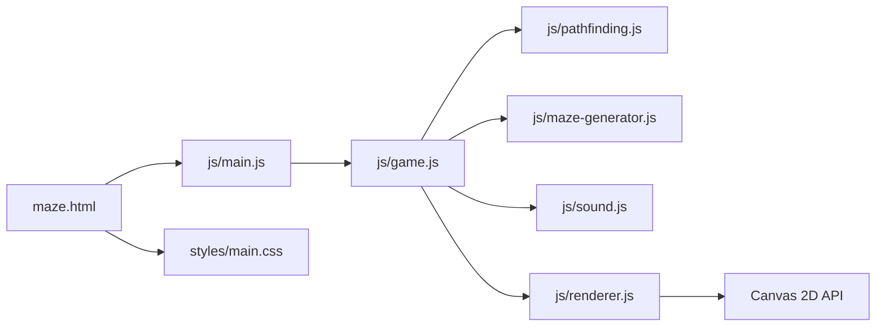
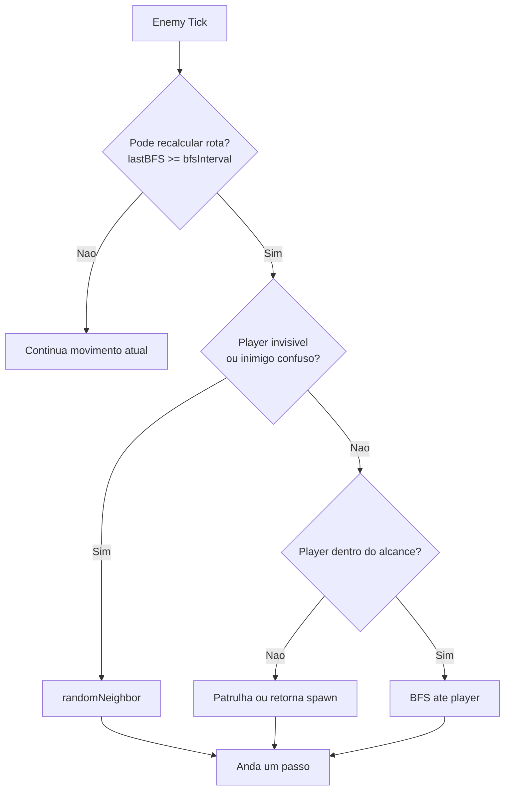

# Maze Runner


## Visao Geral
Maze Runner e um jogo 2D em grid renderizado com HTML5 Canvas. A cada fase, um novo labirinto procedural e gerado, inimigos perseguem o jogador com pathfinding e o objetivo e alcancar a porta de saida antes do tempo acabar.

Objetivo principal:
- Sobreviver aos inimigos.
- Navegar no labirinto.
- Coletar loot e power-ups.
- Alcancar EXIT e avancar de setor.

🔗  Jogue aqui: [https://jpedroreiss.github.io/mazeRunner/](https://jpedroreiss.github.io/mazeRunner/)

## Como Jogar
- Iniciar partida: Enter, Espaco, clique ou toque.
- Mover: setas ou WASD.
- Pausar: P ou Esc.
- Mobile: swipe e D-pad na tela.

## Execucao Local
O projeto usa ES Modules. Entao precisa abrir por servidor local (nao por file://).

Opcao Python:
```bash
python -m http.server 5500
```

Opcao Node:
```bash
npx serve -l 5500
```

Abra:
```bash
http://localhost:5500/maze.html
```

## Estrutura de Modulos
```text
maze.html
styles/main.css
js/main.js
js/game.js
js/renderer.js
js/maze-generator.js
js/pathfinding.js
js/sound.js
```

Responsabilidade de cada modulo:
- maze.html: estrutura da pagina, canvas, D-pad e carga do entrypoint.
- styles/main.css: layout, responsividade e visual de apoio (HUD externa e botoes touch).
- js/main.js: bootstrap do jogo, resize, eventos iniciais e integracao de input touch.
- js/game.js: estado da partida, loop de simulacao, IA, fisica de grid e regras.
- js/renderer.js: pipeline de desenho no canvas, camera, HUD, efeitos e telas.
- js/maze-generator.js: geracao procedural do mapa e utilitarios de celulas abertas.
- js/pathfinding.js: BFS, Manhattan, conectividade e movimento aleatorio local.
- js/sound.js: efeitos sonoros sintetizados via Web Audio API.

## O Que e Canvas Neste Projeto
Canvas e uma area bitmap desenhada em tempo real pelo JavaScript.

No Maze Runner:
- Existe um unico elemento canvas que ocupa a tela.
- O Renderer desenha tudo a cada frame: mundo, personagens, efeitos e HUD.
- O desenho e imediato (modo immediate rendering): nada fica "guardado" no canvas; cada frame limpa e redesenha.

Pipeline de renderizacao:
1. clearRect limpa o frame anterior.
2. desenha fundo e area do mapa.
3. desenha tiles (parede/chao/zonas).
4. desenha entidades (itens, inimigos, jogador).
5. aplica efeitos visuais (fog, brilho, particulas, overlays).
6. desenha HUD e telas de estado (menu, pausa, game over).

Vantagens desse modelo:
- Controle total de performance e estilo visual.
- Facil implementar camera, zoom, transicoes e efeitos.
- Sem dependencia de engine externa.

## Algoritmos Utilizados (Visao Completa)

### 1) BFS (Breadth-First Search) para Pathfinding
Usado em js/pathfinding.js e consumido pela IA em js/game.js.

Quando usar:
- Encontrar menor caminho em numero de passos em grid sem peso.

Como funciona:
1. Parte da celula inicial.
2. Expande vizinhos validos em camadas (nivel por nivel).
3. Marca visitados para nao repetir estados.
4. Ao achar o destino, reconstrui o caminho por ponteiros parent.

Propriedade importante:
- Em grid sem pesos, BFS devolve caminho minimo em passos.

Complexidade:
- Tempo: O(V + E)
- Memoria: O(V)

No contexto do jogo:
- BFS nao roda todo frame para todos inimigos.
- Cada inimigo recalcula rota em intervalos bfsInterval.
- Isso reduz custo computacional e evita gargalo com muitos agentes.

### 2) Distancia Manhattan
Formula:

$$
d(a,b)=|a_x-b_x|+|a_y-b_y|
$$

Por que usar aqui:
- O movimento e ortogonal (4 direcoes), igual a geometria Manhattan.
- E muito barata de calcular.
- Serve para decisoes rapidas sem rodar BFS toda hora.

Uso no projeto:
- Filtrar spawn de inimigos longe do jogador.
- Definir ativacao/perseguicao por raio.
- Definir condicoes de portal e zonas.

Diferenca BFS x Manhattan:
- Manhattan estima distancia geometrica no grid.
- BFS calcula caminho real respeitando paredes.

### 3) Recursive Backtracking para Geracao do Labirinto
Base de geracao em js/maze-generator.js.

Ideia:
- Faz DFS recursivo cavando caminhos entre celulas nao visitadas.
- Gera um "labirinto perfeito" (conectado e sem ciclos na base).

Etapas adicionais do projeto:
- addLoops: abre paredes extras para criar ciclos e alternativas.
- carveOpenAreas: cria manchas abertas para variar navegacao.
- carveLongCuts: cria corredores longos para acelerar fluxo em setores.

Resultado:
- Mapa procedural com mistura de corredor estreito + areas amplas + atalhos.

### 4) Fisher-Yates Shuffle
Usado para randomizacao uniforme de direcoes e selecao de candidatos.

Por que relevante:
- Evita vies de ordem fixa.
- Mantem distribuicao mais justa de escolhas aleatorias.

### 5) Validacao de Conectividade
Sempre que uma parede dinamica fecha/abre ou desliza, o jogo valida conectividade com isConnected (BFS).

Objetivo:
- Evitar estados sem solucao (saida inacessivel).

### 6) Interpolacao e Suavizacao
No render/movimento:
- Posicao logica (grid) separada da posicao renderizada (float).
- Movimento interpola entre celulas para animacao suave.

No visual:
- Lerp de paleta dia/noite.
- Transicoes por alpha para flash, glow e overlays.

## IA dos Inimigos (BFS + Regras)
Cada inimigo combina pathfinding com maquina de decisao simples:

1. Verifica estado (acordado, confuso, invisibilidade do player, distancia ao spawn).
2. Decide alvo:
    - jogador,
    - retorno ao spawn,
    - patrulha,
    - movimento aleatorio.
3. Calcula caminho com BFS quando aplicavel.
4. Anda passo a passo no caminho.
5. Recalcula rota periodicamente (bfsInterval), nao continuamente.

Diferenca por tipo:
- chaser: mais focado em perseguir.
- rusher: alterna perseguicao e comportamento mais agressivo/volatil.
- stalker: usa alcance de visao e pressao situacional.

## Geracao do Labirinto em Camadas
Pipeline da fase:
1. Config da fase define tamanho, densidade e dificuldade.
2. Gera grade base procedural.
3. Escolhe start e saida (celula distante).
4. Distribui itens e inimigos em celulas validas.
5. Cria paredes dinamicas e paredes deslizantes.
6. Aplica zonas tematicas e portais.
7. Valida conectividade em mudancas criticas.

## Loop Principal da Partida
Loop de simulacao em js/game.js:
1. tickDynamicEvents
2. tickEffects
3. tickDayNight
4. tickDynamicWalls
5. tickSlidingWalls
6. tickPhaseTimer
7. tickStamina
8. movePlayer
9. moveEnemies
10. checkCollisions
11. Renderer.render

Esse design separa bem:
- atualizacao de estado (simulacao), e
- apresentacao visual (render).

## Diagrama de Fluxo dos Modulos


## Diagrama de Decisao da IA (resumo)


