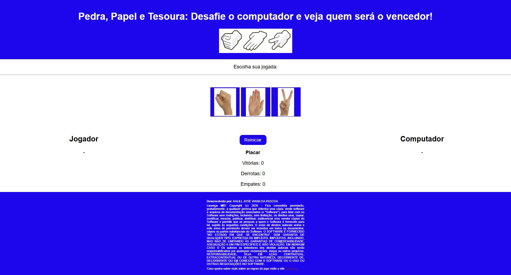

# Pedra, Papel e Tesoura

Jogo desenvolvido utilizando **HTML, CSS e JavaScript**, como parte da Atividade Prática 1 - Desenvolvimento de Jogo Web da disciplina GAC116 - Programação Web - 2026/1.

## Sobre o jogo

O jogador escolhe entre pedra, papel ou tesoura, enquanto o computador faz uma escolha aleatória.

### Regras:
- Pedra vence Tesoura
- Tesoura vence papel
- Papel vence pedra
- Escolhas iguais resultam em empate

## Acesse o jogo online:
https://kalillpascoa.github.io/pedra-papel-tesoura/

## Tecnologias utilizadas:
- HTML5
- CSS3
- JavaScript

## Estrutura do projeto:
/img → imagens do jogo
index.html → estrutura
styles.css → estilo
script.js → lógica

## Licença:
Este projeto está sob a licença MIT.

Desenvolvido por: KALILL JOSÉ VIANA DA PÁSCOA

